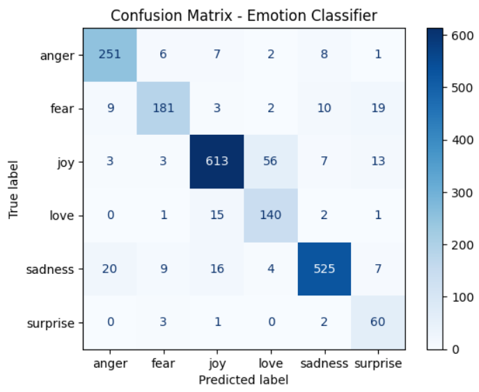
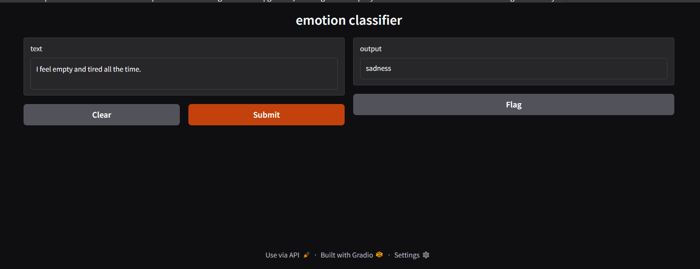

# Emotion Classifier 💬

A **Natural Language Processing (NLP)** app that classifies emotions from text input using machine learning. Built with a full pipeline of tools including **NLTK** for advanced preprocessing, **scikit-learn** for modeling, and **Gradio** for a clean, interactive user interface.

---

## 🚀 Features

- Predicts one of six emotions: **Joy**, **Sadness**, **Anger**, **Fear**, **Love**, **Surprise**
- Built using a TF-IDF vectorizer + Logistic Regression model
- Preprocessing with NLTK:
  - Tokenization
  - Stopword removal
  - Lemmatization
- Deployed with Gradio for instant web-based interaction
- Final accuracy: **88.5%** on test data
- Confusion matrix visualization included

---

## 📊 How to Use This Project

All development and testing were done in **Google Colab**.

To explore or modify the code:
- Open the included `.ipynb` notebook
- Run all cells directly in Colab
- You can export the model (`model.pkl`) if desired

You can also launch the notebook directly in Google Colab using the link below — no setup required.

---

## 📊 Model Overview

- **Model**: Logistic Regression 
- **Vectorizer**: TF-IDF with bigrams (`ngram_range=(1,2)`)
- **Accuracy**: **88.5%** on the test set from the Kaggle Emotion Dataset
- **Training Data**: Combined `train.txt` and `val.txt`
- **Class Balancing**: Applied using `class_weight='balanced'`

### Confusion Matrix

The model shows strong predictive performance across most categories, with the best performance in "Joy" and "Sadness". Some class confusion remains for "Surprise" and "Love" due to data imbalance, but these were mitigated through class weighting and tuning.

---

## 🔢 Example Predictions

| Input Sentence                             | Predicted Emotion |
|--------------------------------------------|-------------------|
| That was the best birthday surprise ever.  | Joy               |
| I am nervous                               | Fear              |
| Stop pretending like you care              | Anger             |
| Why does this always happen to me?         | Sadness           |
| I love you                                 | Love              |
| i honestly am not sure how i feel stunned  | Surprise          |

---
## 🖼️ Output Screenshots

### Web Interface

